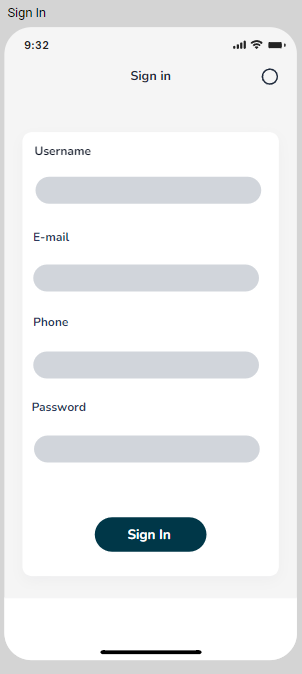
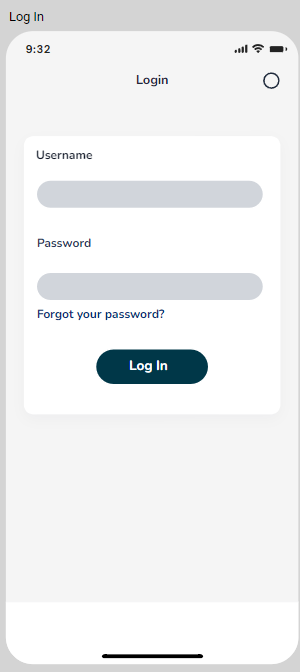
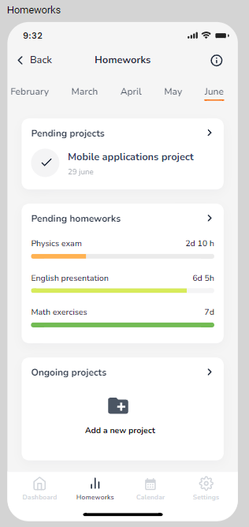
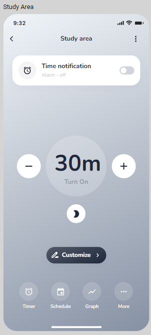

# Diseño de interfaz de usuario

El diseño completo esta disponible
en [Moqups](https://app.moqups.com/YpSwOGDSfpwoDn89T5awiQbEG1bsZMXd/view/page/a111675b7)

## 1. Sign In

   Para usar la aplicacion, el usuario deberá registrarse para acceder a todas las funcionalidades.

   

## 2. Login

   Para acceder a las funcionalidades el usuario debe iniciar sesión.

   

## 3. Dashboard

   Interfaz grafica para acceder a varias de la funcionalidades.

   

## 4. Homeworks

   Interfaz grafica para ver las tareas y proyectos, y a su vez el progreso de estos.

   

## 5. Calendar

   Interfaz grafica para ver las tareas y proyectos asignados en el calendario.

   

## 6. Study area

   Interfaz grafica para gestionar un temporizador, horarios de estudio y analisis de los tiempos de estudio.

   