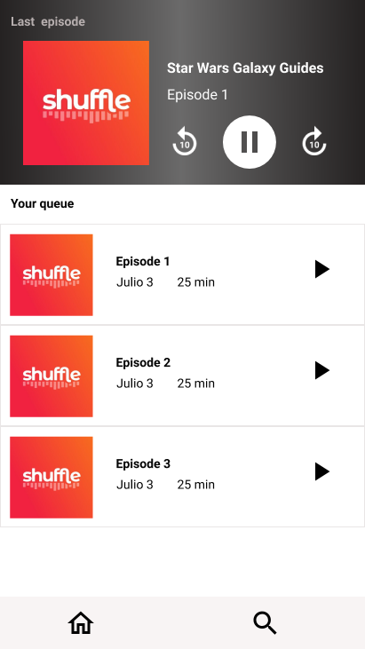
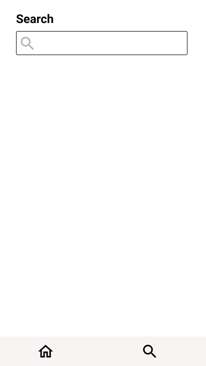

# Diseño de interfaz de usuario

La interfaz de usuario de la aplicación UANCasts esta inspirada en la interfaz de usuari de
aplicaicones similares y en el uso de [Material Design](https://material.io/design).

El diseño completoe esta disponible
en [Figma](https://www.figma.com/proto/hfzawvdC9umcC1e2z56fxR/PodcastsApp?node-id=1%3A2&scaling=scale-down)
. Los colores a usar estar[an basados en una combinación de escalas de gris. A continuación se
presentan las principales pantallas:

1. Lista de Podcasts

   Cuando el usuario ingrese a la aplicaicón verá una lista con los podcasts disponibles tomados
   desde el API.

   

2. Episodios de un Podcast

   Al seleccionar un Podcats, el usuario verá la lista de episodios de ese podcasts y podrá
   reproducirlos.

   

3. Búsqueda podcasts

   Adicionalmente el usuario podrá buscar los Podcasts de su interes usando palabras clave.

   
